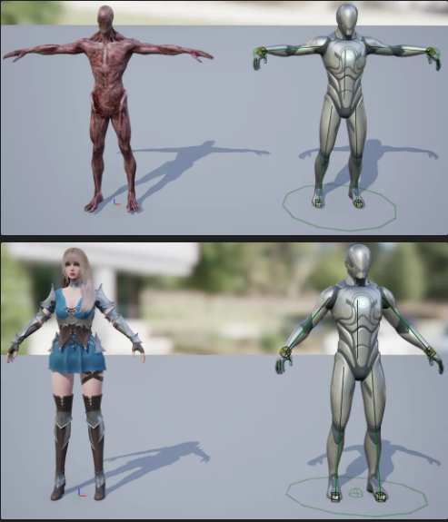

# $\large\bf\color{#556B2F}Unreal\ Engine5\ Project$

### $\large\bf\color{#CD5C5C}프로젝트\ 명$
Smart AI

### $\large\bf\color{#CD5C5C}프로젝트\ 인원$
1명 (김기훈)

### $\large\bf\color{#CD5C5C}프로젝트\ 기간$
2024/10/17 ~ 진행중

### $\large\bf\color{#CD5C5C}목적$
① 다양한 감각 기관을 통해 플레이어를 인식하는 Monster AI 제작 
② Perception AI Component 학습 
③ Unreal Blueprint 와 Unreal C++ 의 활용 능력의 향상 
④ 기능 구현 및 응용 능력 향상 
⑤ 게임 엔진의 구조와 흐름에 대한 이해 

### $\large\bf\color{#CD5C5C}진행계획$
1주차 : Asset 수급 후, Monster 클래스에 AI Perception 추가 
2주차 : Behavior Tree 작성후 Listen Server 로 Multi 환경 테스트 
3주차 : 스킬 생성 및 플레이어와 상호작용 태스트 

### $\large\bf\color{#CD5C5C}결과물$
<b>[ Notion URL ]</b> 
$\color{#4F4F4F}(\ ↓ 이미지\ 클릭시\ 해당\ 페이지로\ 이동합니다.↓\ )$ 
<a href="https://reminiscent-moth-47a.notion.site/UE5-Monster-AI-1227e40d2ccc80fbb3d3dc7847244780?pvs=4">
    

<b>[ Youtube URL ]</b> 
- 

### $\large\bf\color{#CD5C5C}타임라인$
<b>24/10/17 : </b> 
-&nbsp;프로젝트 생성 및 업로드 
-&nbsp;PlayerBase, MonsterBase 클래스 생성 
-&nbsp;Mixamo 에서 Monster Mesh 수급 
&nbsp;&nbsp; 
-&nbsp;Monster, Player Mesh 설정 및 리타겟 
&nbsp;&nbsp; 
-&nbsp;Player 애니메이션 블루프린트 생성 및 적용 
&nbsp;&nbsp; 

<b>24/10/19 : </b> 
-&nbsp;Mixamo Animation 에 Coverter를 활용하여 Root 추가후 Import 
&nbsp;&nbsp; 
